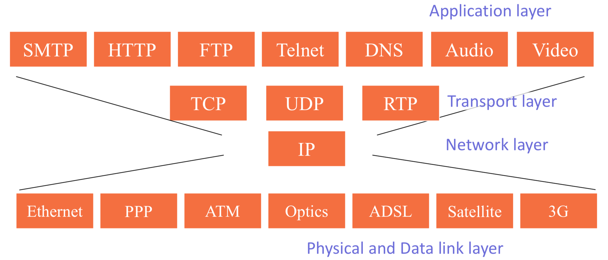
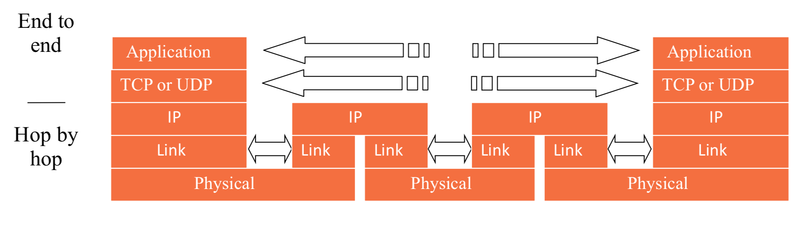
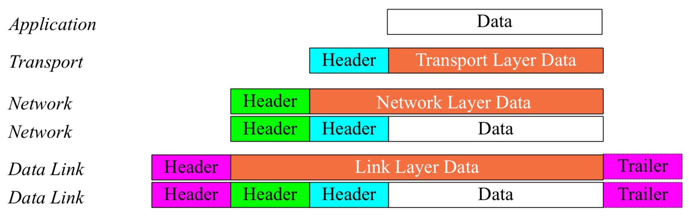

# Final Review

## Overview of the Internet of Things

### Definition of Internet of Things 

* Make every single **'network enabled' object** in the world **network connected**, and represents a vision in which the Internet extends into the real world embracing everyday objects
* A self-configured dynamic global **network infrastructure** with standards and interoperable communication protocols where **physical and virtual 'things'** have identities, physical attributes, and virtual personalities, and are seamlessly **integrated into** the information **infrastructure**

### Core technologies of the IoT  

* Three Dimensions
  * Any time connection
  * Any place connection
  * Any thing connection
* Core Technologies 
  * hardware
  * near-field communication
  * networking
  * data fusion and decision making
* Three Technology Levels (high to low)
  * Intelligence level (Data fusion, Service discovery) 
  * Communication & Networking level (Data and Query transmission) 
    * Web design (html, dhtml, javascript, HCI) 
    * Internet architecture, communication proposal (TCP/IP, UML) 
    * IPv6 
  * Technology level (Interface between the real and the digital worlds) 
    * 6LowPAN: Low-power RF + IPv6
    * Open, long-lived, reliable, easy, transparent, maintainability, scalability end-to-end

### Applications

* The areas of healthcare, smart buildings,  social networks, environment monitoring, transportation and logistics
* Characteristics
  * Global and real-time solution
  * It is mainly wireless oriented and able to provide comprehensive data about its surroundings in both indoor and outdoor environments
  * It has the ability of remotely monitoring the environment and tracing or tracking objects

### Future Development

* Next generation of the Internet
* Pervasive computing
* Less mature compared with the other subjects

## Introduction to wireless networks

### Introduction 

* The network of radio-connected devices and servers using voice, information and other Internet services. 
* Benefits 
  * Reduced installation costs
  * Flexibility
  * Extended reach
  * Precondition for ubiquitous computing 

### Wireless networks 

* WAN – Wide Area Network (3G, WiMAX) 
  * 2500 meters, GSM, GPRS
* LAN – Local Area Network (WiFi) 
  * 100 meters, 802.11b
* PAN – Personal Area Network (ZigBee, 6LowPAN) 
  * Low-power, 10 meters, Bluetooth, IR 

#### WiMAX

* Worldwide Interoperability for Microwave Accessfor the last mile (30 miles)
* An evolving standard for point-to-multipoint wireless networking
* Architecture
  * A WiMAX Tower
    * Can connect directly to the Internet using a high-bandwidth, wired connection or another WiMAX Tower
  * A WiMAX Receiver
* IEEE 802.16e allow consumers to connect to the Internet while they are moving

#### Standards 

* WiFi
  * Same as IEEE 802.11b
  * Transmission rate: 11 Mbps 
  * Bandwidth: 2.4 GHz 
  * Coverage: 300 m 
  * Support devices: 25
* IEEE 802.11a 
  * 54 Mbps, 5 GHz, incompatible with Wi-Fi 
* IEEE 802.11g
  * 54 Mbps, 2.4 GHz, cheap, support apple
* Bluetooth
  * low-cost, low-power, short-range radio link, 70 kbps 
* HomeRF 
  * Accommodate a maximum of 127 nodes
* Infrared Technology 
  * Range of 2M, strictly point-to-point connection

### Network evolution 

* 1G
  * FDMA: Frequency Divided Multiple Access 
  * Circuit-switched, analog signals, Voice only 
* 2G
  * TDMA: Time Divided Multiple Access 
  * GSM: Global System for Mobile Communications
  * Circuit-switched, digital signals, voice or data overlay, 9 kbps or 19 kbps 
* 2.5G
  * GPRS, first packet data service on wireless digital networks, 115 kbps 
* 3G
  * WCDMA, CDMA: Code Divided Multiple Access  
  * Packet-switched, Transparent roaming, 2Mbps, Identification of caller location 

### Satellite network 

* GEO – Geosynchronous Earth Orbiting  
* MEO – Medium Earth Orbiting
* LEO - Low Earth Orbiting 

## Introduction to WSNs

* Wireless Technologies 
  * Infrared (IR) technology: for indoor use as IR rays cannot penetrate walls, ceilings or other obstacles, and needs a line of sight between each other 
  * Radio frequency (RF) technology 
    * Narrowband signal
    * Spread-spectrum signal

### Zigbee 

* Based on IEEE 802.15.4
* Feature
  * Low data rate, cost, complexity, power consumption
  * Easy to implement, uses small packets support upto 65,000 nodes, automatically establish
* Procedure
  * The Coordinator set working channel and network id. 
  * The Zigbee stack running on the coordinator builds the network using parameters. 
  * The Coordinator waits for other devices’ requests to join in. 
  * Router and End Device use configured network parameters to request to join the network. 

### Wireless LAN

* Also called IEEE 802.11
* Enables users to access an organisation’s network from any location inside the organisation without any physical connection to the organisation’s network 

### What are WSNs

* Wireless sensor network
* Low-power, wireless sensor nodes with tiny amount of CPU/memory 
* Networked for high-resolution sensing of environment  

### Evolution of WSNs

* Sensor
  * A device that measures a physical quantity and converts it into readable format 
  * Readings make the conditions of the objects visible, comparable, and concrete to human beings 
* Controlled by a central controller, or through a bus system
* Pros and Cons
  * Advantages: simple, reliable
  * Disadvantages: high installation cost, difficult to extend
* Composition
    * Wireless communication module
    * Microprocessor
    * Sensor
    * Network and Application Protocol
* Application 
  * Home automation 
  * Telehealth care 
  * Remote control 
  * Advanced metering 
  * Intelligent lighting control 
  * Area monitoring 

### Research fields involved in WSNs 

* Task description: collection or communication
* Design challenges
  * Autonomous system embedded in unattended sensor node 
  * Establishment of an effective and reliable radio communication network 
  * Stand-alone wireless sensor nodes with radio communication present serious energy constraints 
  * High level data processing within a distributed wireless sensor network 
* Research fields
  * communication protocols
  * routing protocols 
  * power management for embedded system
  * embedded software design
  * data fusion  
  * heterogeneous networks 

## IP and Networking Basics 

### What is the Internet 

* Internet: “network of networks” 
  * millions of connected computing devices: hosts, end-systems running network apps 
  * communication links 
  * routers: forward packets (chunks) of data through network 
  * protocols: control sending, receiving of messages 
* Standards
  * RFC: Request for comments
  * IETF: Internet Engineering Task Force 

### Internet Structure and ISPs 

* ISP: Internet service provider
* Roughly hierarchical 
* At center: 􏰆tier-1􏰀 ISPs
  * interconnect (peer) privately 
  * interconnect at public network access points (NAPs) 
* 􏰆Tier-2􏰀 ISPs: smaller (often regional) ISPs
  * customer of tier-1 provider 
  * peer privately with each other, interconnect at NAP
* 􏰆Tier-3􏰀 ISPs and local ISPs 
  * customers of  higher tier ISPs connecting them to rest of Internet 

### Internet Fundamental Principles 

* Edge
  * end systems (hosts) 
  * client/server model 
  * peer-peer model
  * Data Transfer between end system (TCP, UDP)
* Core
  * mesh of interconnected routers 
  * move packets through routers from source to destination
* Layered System
  * Why?
    * explicit structure allows identification, relationship of complex system’s pieces 
    * modularization eases maintenance, updating of system  
* Network of collaborated networks 

### OSI stack and TCP/IP model  

* OSI Model

  * Application

  * Preesentation

  * Session

  * Transport

  * Network

  * Data Link

  * Physical

  * Upper Layers(7-4): Application oriented, “End-to-End”-Layers 

    Lower Layers(3-1): Network oriented, “Hop-by-hop” layers 

*  IP Hourglass Model

#### TCP/IP Model

* Unifying effect of the network layer 
  - Define a protocol that works in the same way with any underlying network
  - IP routers operate at the network layer
* End-to-end layers 
  * They do not concern themselves with the details of what happens in between, and behave as if they can talk directly to each other 
  * Application Layer: in reality the application at each side talks to the TCP or UDP service below it. 
  * Transport Layer: in reality they are each talking to the IP layer below it, don't care what application layer is doing above it.
* Hop-by-hop layers 
  * At the lower layers, devices share access to the same physical medium, and devices communicate directly with each other 
  * Network Layer: know a lot about the topology of the network (which host is connected to which router, which routers are connected to each other), forwards message hop by hop 
  * Link and Physical Layers: The link layer very Application closely tied to the physical layer below it, and All links are independent of each other, and have no way of communicating with each other. 
* Different names for packets at different layers 
  * Ethernet (link layer) frame
  * IP (network layer) datagram
  * TCP (transport layer) segment 
  * Any layer: packet

#### Encapsulation & Decapsulation 

* Layer 2 - Ethernet frame 
  * Destination and source are 48-bit MAC addresses  
  * Type 0x0800 means that the “data” portion of the Ethernet frame contains an IPv4 datagram. Type 0x0806 for ARP. Type 0x86DD for IPv6. 
* Layer 3 - IPv4 datagram 
  * Source and Destination are 32-bit IPv4 addresses 
  * Protocol = 6 means TCP segment. Protocol = 17 means UDP. 
* Layer 4 - TCP segment 
  * Source and Destination are 16-bit TCP port numbers (IP addresses are implied by the IP header)
  * If no options, Data Offset = 5 (which means 20 octets) 

### IPv4, Addressing, classes, subnetting and masks  

#### IP address

* Purpose 
  * Unique Identification of Source and Destination
  * Network Independent Format 
  * Identifies a machine’s connection  
* IPv4 uses unique 32-bit addresses  
* IPv6 used similar concepts but 128-bit addresses 
* Structure: 32 bit number 

#### Addressing in Internetworks 

* Problems
  * More than one physical network
  * Different Locations
  * Larger number of hosts
* Structured numbering system: hosts that are connected to the same physical network have “similar” IP addresses 
* Divide IPv4 address into a “network part” and “host part” 
  * Network Part (or Prefix) – high order bits (left), physical network
  * Host Part – low order bits (right), hosts 

#### Network Masks 

* Define which bits are used to describe the Network Part and which for the Host Part
* 137.158.128.0/17 (netmask 255.255.128.0) 
* All 0’s in host part: Represents Network 
* All 1’s in host part: Broadcast 
* 127.0.0.0/8: Loopback address (127.0.0.1) 
* 0.0.0.0: Various special purposes
* The number of bits in the host part determines the maximum number of hosts, all-zeros and all-ones addresses are reserved 

## Advanced Wireless Ad hoc Networks 

### Concept of Ad Hoc networks

* MANETs (Mobile Ad hoc NETworks) are networks which can come in and out of existence without the need for any prior planning 
* An ad hoc network is a Peer-to-Peer network (no centralized server/backbone) set up temporarily to meet some immediate need. 

### Characteristics 

* Infrastructure-less wireless networks dynamically formed using only mobile hosts 

  (no fixed routers) 

* Network topology dynamic as all hosts are mobile! 

* Mobile hosts themselves act as routers!! 

* Multi-hop paths 

* Highly resource constrained 

* Highly variable network mobility

* May co-exist (and co-operate) with an infrastructure-based network

#### Mobility characteristics

* Speed 
* Predictability  
* Uniformity (or lack thereof) of mobility characteristics among different nodes 

### Goals

* Participation of Mobile hosts 
* Robust and self-configuring architecture 
* Involve as few nodes as possible 
* Low-cost communication mechanisms 
* Avoid series of local broadcasts 

### Applications

* Personal area networking  
* Military environments  
* Civilian environments 
* Emergency operations 

### Differences: Ad Hoc network and wireless LAN

* The classical wireless LAN has a fixed infrastructure (backbone) consisting of one or more cells (coverage areas) with a control modulefor each cell. 
* Within a cell (coverage area), there may be a number of fixed end systems (nodes). 
* Nomadic stations/nodes can move from one cell to another. 
* There is no infrastructure for an ad-hoc network. 
* Rather, a peer collection of stations within range of each other may dynamically configure themselves into a temporary network. 

### Challenge

* Limited wireless transmission range 
* Broadcast nature of the wireless medium
* Packet losses due to transmission errors
* Mobility-induced route changes
* Mobility-induced packet losses
* Battery constraints (Power Control) 
* Potentially frequent network partitions
* Ease of snooping on wireless transmissions (security hazard) 

### Concept of routing

* Difference
  * Host mobility
  * Rate of link failure/repair may be high when nodes move fast 
  * New performance criteria may be used 
* Ideal
  * Low overhead route computation
  * Ability to recover from frequent failures at low-cost 
  * Scalable (with respect to mobility and number of hosts) 
  * Robust 
* Protocols 
  * Proactive Protocols  
  * Reactive Protocols 
  * Hierarchical Routing 
  * Geographic Position Assisted Routing  

### Dynamic Source Routing (DSR)

#### Route Discovery 

* Source node S floods (broadcasts) Route Request (RREQ) packet, contains \<target address, initiator address, route record, request ID> 
* If a node receives a broadcast packet 
  - If the node is the receiver (i.e., has the correct destination address) then return the packet to the sender. 
  - If the packet has already been received earlier: \< initiator address, request ID> is in its list then discard the packet 
  - Otherwise, append own address and broadcast packet 
* Maintaining Paths 
  * Wait for a layer 2 acknowledgement   
  * Listen into the medium to detect if other stations forward the packet (if possible) 
  * Request an explicit ACK
* Destination D on receiving the first RREQ, sends a Route Reply (RREP) 
* RREP includes the route from S to D on which RREQ was received by node D 
* Packet header size grows with route length 

#### Optimization: Route Caching

* A node may also learn a route when it overhears Data packets
* When node S learns that a route to node D is broken, it uses another route from its local cache, if such a route to D exists in its cache.
* Can Speed up Route Discovery
* Reduce Propagation of Route Requests 

### AODV

* When a source node wants to send a message to some destination node and does not already have a valid route to that destination, it initiates a Path Discovery Process to locate the destination (as in DSR case) 

### Destination Sequenced Distance Vector (DSDV)

* Each node maintains a routing table which stores 
  * Next hop towards each destination 
  * A cost metric for the path to each destination
  * A destination sequence number that is created by the destination itself 
* Each node periodically forwards the routing table to its neighbors 
* Each node increments and appends its sequence number when sending its local routing table 
* This sequence number will be attached to route entries created for this node 
* Advantages
  * Simple (similar to Distance Vector) 
  * Loop free through destination sequence numbers 
  * No latency caused by route discovery
* Disadvantages 
  * No sleeping nodes 
  * Overhead: most routing information never used 
  * Poor Scalability  

### Why not TCP

* Window based transmissions
* Slow-start 
* Loss based congestion detection
* Linear increase multiplicative decrease
* Self-clocking (reliance on ACKs) 

### Hidden/exposed problems

* Hidden Terminal
  * More collisions
  * Wastage of resources 
* Exposed Terminal
  * Underutilization of channel
  * Lower effective throughput 
* MACA Multiple Access with Collision Avoidance 
  - RTS (Request To Send): A sender requests the right to send from a receiver with a short RTS packet before it sends a data packet 
  - CTS (Clear To Send): The receiver grants the right to send as soon as it is ready to receive 

### Challenges 

* How we can avoid producing a nice but useless (MANET) technology?
* What the research community should do to push the MANET technology in the wireless world?
* Which should be the correct research approach? 

## Hardware Design in WSNs 

* The first requirement of building a WSN is to develop sensor nodes, which have to meet the requirements that come from the specific requirements of a given application. Normally, sensor nodes should be small, cheap, energy efficient, wireless, and storage capability. 
* subsystems: 
  - microprocessor with memories 
  - short range radio for wireless communication 
  - links the node to the physical world and consists of a group of sensors and actuators 
  - power to the whole system. 

### WSN Hardware design considerations

* Lifetime
* Coverage: It means the radius of the area that sensor can detect an event in it. 
* Robustness
* Security
* Communication: Sensor nodes should have low communication rate
* Time Synchronization
* Cost and size

### Hardware Design Steps 

* Microcontroller selection
* A communication device Selection
* Designing sensing devices
* Power supply device design 

### WSN’s lifetime calculation 

* CPU power consumption domain
* RF transceiver power consumption domain
* Sensors power consumption domain 

### Ways to improve: Power management 

* Useful energy:
  * Sensing environment
  * Data processing
  * Transmitting or receiving data
  * Processing query requests 
* Waste energy in WSN
  * Data acquisition stage (Sensor)
  * Data processing stage (CPU)
  * Data Communication (Radio) 

## Embedded Software Design in WSNs 

### Introduction  

* Wireless sensor networks 
  * Hardware: implementer of the sensing tasks and radio communications
  * Software: driver of the hardware and implementer of the communication protocols 

### Architecture design

- Hardware Layer:Sensordriver 
- Medium Access Control Layer: Local wireless communication 
- Network Layer: Establishment of self-organized, ad hoc network ---Implementation of routing protocol 
- Application Layer: Data processing, interface design, data communication between remote system and local WSNs 

